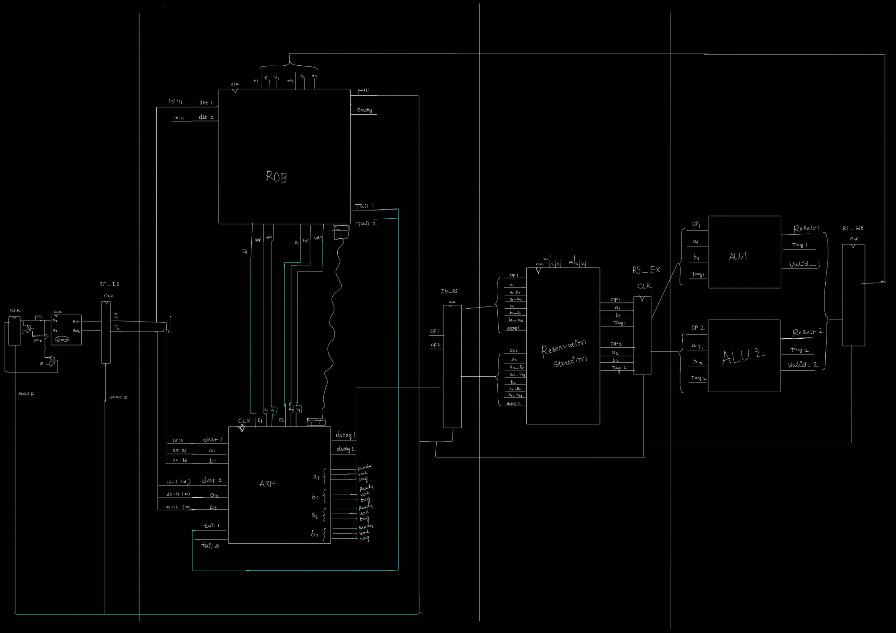

# 2-Wide Superscalar Processor (Tomasulo-Based)

This project implements a **2-wide superscalar out-of-order processor** in **SystemVerilog** using concepts inspired by **Tomasulo’s Algorithm**.

The processor supports:

- Dual instruction fetch
- Dual issue
- Register renaming
- Reservation stations
- Reorder buffer (ROB)
- Out-of-order execution
- In-order commit
- Multi-ALU execution

The design is modular and simulation-friendly for debugging with GTKWave.

---

# Architecture


---

# Features

## Dual-Issue Fetch

- Fetches 2 instructions per cycle
- Parallel decode support

---

## Register Renaming

Implemented using:

- Busy bit
- Tag
- Data fields

```systemverilog
logic [31:0] data [0:31];
logic        busy [0:31];
logic [3:0]  tag  [0:31];
```

---

## Reservation Station

Supports:

- Operand waiting
- Tag matching
- Wakeup from writeback
- Dynamic scheduling
- Dual issue

---

## Reorder Buffer (ROB)

Provides:

- In-order commit
- Precise state
- Result buffering
- Register mapping

---

## Out-of-Order Execution

Instructions execute as soon as operands become ready.

Supports:

- RAW dependency tracking
- Wakeup and forwarding
- Dynamic execution ordering

---

# Supported Instructions

| Instruction | Opcode |
|---|---|
| ADD | `6'h20` |
| SUB | `6'h22` |
| AND | `6'h24` |
| OR  | `6'h25` |
| XOR | `6'h26` |
| SLT | `6'h2A` |
| MUL | `6'h18` |
| DIV | `6'h1A` |

---

# Example Instruction Stream

```assembly
add r1,r2,r3
sub r5,r1,r5
mul r6,r7,r8
mul r6,r6,r7
```

This demonstrates:

- RAW dependencies
- Register renaming
- Out-of-order scheduling
- ROB commit behavior

---

# Pipeline Stages

| Stage | Description |
|---|---|
| IF | Instruction Fetch |
| ID | Decode + Rename |
| RS | Reservation Station |
| EX | Execute |
| WB | Writeback |
| COMMIT | ROB Commit |

---

# Important Design Concepts

## Register Renaming

Eliminates:

- WAR hazards
- WAW hazards

using ROB tags.

---

## Operand Wakeup

Reservation stations monitor writeback buses:

```text
WB Tag == Source Tag
```

If matched:

- Operand becomes ready
- Value is forwarded

---

## In-Order Commit

Even though execution is out-of-order:

```text
Commit always occurs in program order
```

using ROB head pointer.

---

# Debugging Features

The processor prints:

- ROB table
- ARF table
- Fetched instructions
- Clock cycles

during simulation.

Example ROB print:

```text
========== ROB TABLE ==========
HEAD=2 TAIL=6 COUNT=4
IDX | BUSY | VALID | DEST | VALUE
```

Example ARF print:

```text
=============== ARF TABLE ===============
REG | BUSY | TAG | DATA
```

---

# File Structure

| Module | Purpose |
|---|---|
| `superscalar_top.sv` | Top-level integration |
| `imem.sv` | Instruction memory |
| `flopr.sv` | Program counter register |
| `IF_ID.sv` | IF/ID pipeline register |
| `architectural_register_file.sv` | Register rename + operand read |
| `reorder_buffer.sv` | ROB implementation |
| `reservation_station.sv` | Dynamic scheduling |
| `ID_RS.sv` | Pipeline register |
| `RS_EX.sv` | Execute pipeline register |
| `RS_WB.sv` | Writeback pipeline register |
| `alu.sv` | Functional unit |

---

# Simulation

## Compile

Using Icarus Verilog:

```bash
iverilog -g2012 *.sv -o sim.out
```

---

## Run

```bash
vvp sim.out
```

---

## GTKWave

```bash
gtkwave dump.vcd
```

---

# Future Improvements

Possible extensions:

- Branch prediction
- Branch recovery
- Load/store queue
- Memory disambiguation


---
